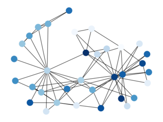
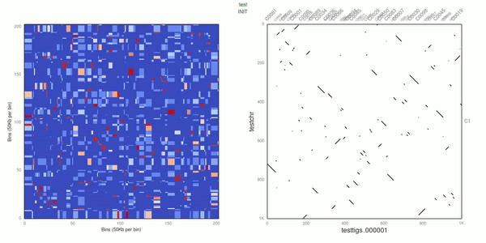
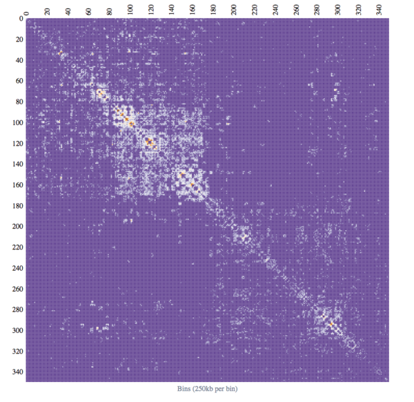

# ALLHIC: Genome scaffolding based on Hi-C data

         _       _____     _____     ____  ____  _____   ______
        / \     |_   _|   |_   _|   |_   ||   _||_   _|.' ___  |
       / _ \      | |       | |       | |__| |    | | / .'   \_|
      / ___ \     | |   _   | |   _   |  __  |    | | | |
    _/ /   \ \_  _| |__/ | _| |__/ | _| |  | |_  _| |_\ `.___.'\
    |____| |____||________||________||____||____||_____|`.____ .'

[](https://travis-ci.org/tanghaibao/allhic)

|         |                                                               |
| ------- | ------------------------------------------------------------- |
| Authors | Haibao Tang ([tanghaibao](http://github.com/tanghaibao))      |
|         | Xingtan Zhang ([tangerzhang](https://github.com/tangerzhang)) |
| Email   | <tanghaibao@gmail.com>                                        |
| License | [BSD](http://creativecommons.org/licenses/BSD/)               |

## Introduction

This program can be used to scaffold genomic contigs based on Hi-C data, which is particularly effectively for auto-polyploid genomes. **We currently recommend using this program in a scripted pipeline, as detailed [here](https://github.com/tangerzhang/ALLHiC/wiki).**

## Installation

The easiest way to install allhic is to download the latest binary from
the [releases](https://github.com/tanghaibao/allhic/releases) and make sure to
`chmod +x` the resulting binary.

If you are using [go](https://github.com/golang/go), you can build from source with:

```console
go get -u -t -v github.com/tanghaibao/allhic/...
go install github.com/tanghaibao/allhic/cmd/allhic
```

## Usage

### <kbd>Extract</kbd>

Extract does a fair amount of preprocessing: 1) extract inter-contig links into a more compact form, specifically into `.clm`; 2) extract intra-contig links and build a distribution; 3) count up the restriction sites to be used in normalization (similar to LACHESIS); 4) bundles the inter-contig links into pairs of contigs.

```console
allhic extract tests/test.bam tests/seq.fasta.gz
```

### <kbd>Prune</kbd>

This prune step is **optional** for typical inbreeding diploid genomes.
However, pruning will improve the quality of assembly of polyploid genomes.
Prune pairs file to remove allelic/cross-allelic links.

```console
allhic prune tests/Allele.ctg.table tests/test.pairs.txt
```

Please see help string of `allhic prune` on the formatting of
`Allele.ctg.table`.

### <kbd>Partition</kbd>

Given a target `k`, number of partitions, the goal of the partitioning
is to separate all the contigs into separate clusters. As with all
clustering algorithm, there is an optimization goal here. The
LACHESIS algorithm is a hierarchical clustering algorithm using
average links, which is the same method used by ALLHIC.




```console
allhic partition tests/test.counts_GATC.txt tests/test.pairs.txt
```

Critically, if you have applied the pruning step above, use the "pruned" pairs:

```console
allhic partition tests/test.counts_GATC.txt tests/test.pairs.prune.txt
```

### <kbd>Optimize</kbd>

Given a set of Hi-C contacts between contigs, as specified in the
clmfile, reconstruct the highest scoring ordering and orientations
for these contigs.

Optimize uses Genetic Algorithm (GA) to search for the best scoring solution.
GA has been successfully applied to genome scaffolding tasks in the past
(see ALLMAPS; [Tang et al. _Genome Biology_, 2015](https://genomebiology.biomedcentral.com/articles/10.1186/s13059-014-0573-1)).



```console
allhic optimize tests/test.counts_GATC.2g1.txt tests/test.clm
allhic optimize tests/test.counts_GATC.2g2.txt tests/test.clm
```

### <kbd>Build</kbd>

Build genome release, including `.agp` and `.fasta` output.

```console
allhic build tests/test.counts_GATC.2g?.tour tests/seq.fasta.gz tests/asm-2g.chr.fasta
```

### <kbd>Plot</kbd>

Use [d3.js](https://d3js.org/) to visualize the heatmap.

```console
allhic plot tests/test.bam tests/test.counts_GATC.2g1.tour
```



## <kbd>Pipeline</kbd>

Please see detailed steps in a scripted pipeline [here](https://github.com/tangerzhang/ALLHiC/wiki).

## WIP features

- [x] Add partition split inside "partition"
- [x] Use clustering when k = 1
- [x] Isolate matrix generation to "plot"
- [x] Add "pipeline" to simplify execution
- [x] Make "build" to merge subgroup tours
- [x] Provide better error messages for "file not found"
- [ ] Plot the boundary of the contigs in "plot" using genome.json
- [ ] Add dot plot to "plot"
- [ ] Compare numerical output with Lachesis
- [ ] Improve Ler0 results
- [ ] Translate "prune" from C++ code to golang
- [ ] Add test suites

## Reference

Xingtan Zhang, Shengcheng Zhang, Qian Zhao, Ray Ming & Haibao Tang. Assembly of
allele-aware, chromosomal-scale autopolyploid genomes based on Hi-C data. (2019) _Nature
Plants._ [link](https://www.nature.com/articles/s41477-019-0487-8)
