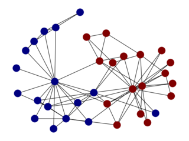

# ALLHIC: Genome scaffolding based on HiC data

         _       _____     _____     ____  ____  _____   ______
        / \     |_   _|   |_   _|   |_   ||   _||_   _|.' ___  |
       / _ \      | |       | |       | |__| |    | | / .'   \_|
      / ___ \     | |   _   | |   _   |  __  |    | | | |
    _/ /   \ \_  _| |__/ | _| |__/ | _| |  | |_  _| |_\ `.___.'\
    |____| |____||________||________||____||____||_____|`.____ .'

[](https://travis-ci.org/tanghaibao/allhic)
[](https://goreportcard.com/report/github.com/tanghaibao/allhic)

**This software is currently under active development. DO NOT USE.**

## Installation

The easiest way to install allhic is to download the latest binary from
the [releases](https://github.com/tanghaibao/allhic/releases) and make sure to
`chmod +x` the resulting binary.

If you are using [go](https://github.com/golang/go), you can build from source with:

```console
go get -u -t -v github.com/tanghaibao/allhic/...
go install github.com/tanghaibao/allhic/cmd/allhic
```

## Usage

### <kbd>Prune</kbd>

Prune bamfile to remove weak links. WIP.

### <kbd>Extract</kbd>

Extract does a fair amount of preprocessing: 1) extract inter-contig links into a more compact form, specifically into `.clm`; 2) extract intra-contig links and build a distribution; 3) count up the restriction sites to be used in normalization (similar to LACHESIS); 4) bundles the inter-contig links into pairs of contigs.

```console
allhic extract tests/test.bam tests/test.fasta
```

### <kbd>Partition</kbd>

Given a target `k`, number of partitions, the goal of the partitioning
is to separate all the contigs into separate clusters. As with all
clustering algorithm, there is an optimization goal here. The
LACHESIS algorithm is a hierarchical clustering algorithm using
average links, which is the same method used by ALLHIC.




```console
allhic partition tests/test.counts_GATC.txt tests/test.pairs.txt
```

### <kbd>Optimize</kbd>

Given a set of Hi-C contacts between contigs, as specified in the
clmfile, reconstruct the highest scoring ordering and orientations
for these contigs.

Optimize uses Genetic Algorithm (GA) to search for the best scoring solution. GA has been successfully applied to genome scaffolding tasks in the past (see ALLMAPS; [Tang et al. *Genome Biology*, 2015](https://genomebiology.biomedcentral.com/articles/10.1186/s13059-014-0573-1)).


```console
allhic optimize tests/test.counts_GATC.txt tests/test.clm
```

### <kbd>Build</kbd>

Build genome release. WIP.

## Pipeline

Following the 4 steps of `prune`, `extract`, `partition`, `optimize`

```console
allhic extract T4_Chr1/{prunning.sub.bam,seq.fasta}
allhic partition T4_Chr1/{prunning.sub.counts_GATC.txt,prunning.sub.pairs.txt} 2
allhic optimize T4_Chr1/{prunning.sub.counts_GATC.txt,prunning.sub.clm}
allhic build T4_Chr/{prunning.sub.tour,seq.fasta}
```

## WIP features

- [x] Add restriction enzyme for better normalization of contig lengths
- [ ] Translate "prune" from C++ code to golang
- [ ] Add partition split inside "partition"
- [ ] Isolate matrix generation to "plot"
- [ ] Add "pipeline" to simplify execution
- [ ] Use clustering when k = 1
- [ ] Compare numerical output with Lachesis
- [ ] Improve Ler0 results
- [ ] Add test suites
